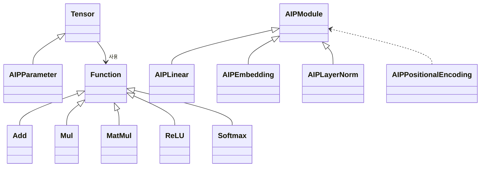
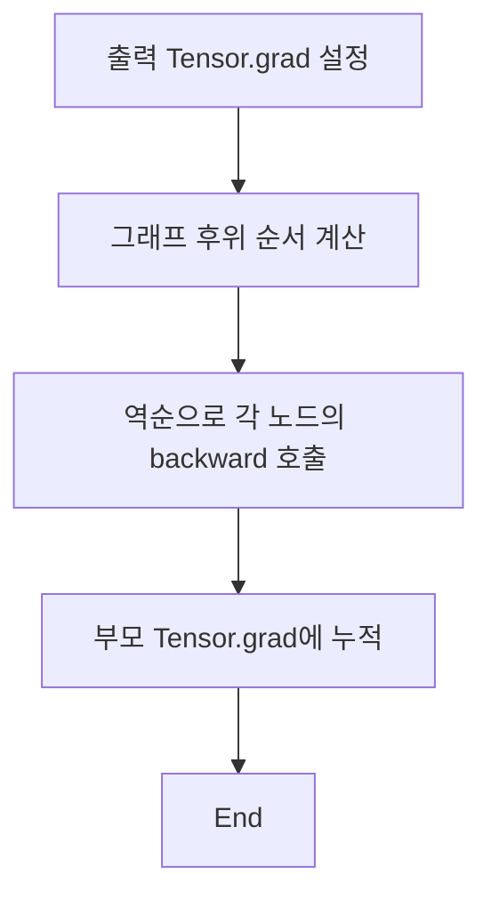

# Minigrad 코드 심층 해설

이 문서는 Minigrad 레포지토리의 핵심 소스 코드를 세부적으로 분석하여 한국어로 정리한 것입니다. 각 파일에 구현된 기능과 흐름을 코드 라인 단위로 짚어 보면서, 처음 보는 사람도 내부 동작을 이해할 수 있도록 설명합니다.

## 1. 레포지토리 구조

```
minigrad/
├── tensor.py         # Tensor 클래스와 자동미분 로직
├── functions.py      # 개별 연산(Function) 구현
├── nn/
│   ├── module.py     # 모듈/파라미터 관리 클래스
│   ├── layers.py     # 기본 신경망 계층 모음
│   └── positional.py # 위치 인코딩 구현
examples/             # 사용 예제 스크립트
```
README에도 동일한 구조가 소개되어 있습니다.【F:README.md†L38-L49】

## 2. Tensor 클래스

`tensor.py`의 `Tensor`는 모든 값과 그래프 노드를 나타냅니다. 주요 속성은 다음과 같습니다.
- `data`: 실제 NumPy 배열 데이터
- `requires_grad`: 역전파 대상 여부
- `grad`: 누적된 그래디언트(초기값 `None`)
- `_ctx`: 이 Tensor를 만든 연산(Function) 객체

### 2.1 backward 로직

`backward()` 메서드(라인 11~47)는 세 단계로 진행됩니다.
1. **토폴로지 순서 계산**: DFS를 사용해 연산 그래프를 후위 순회하여 `topo` 리스트를 만듭니다.【F:minigrad/tensor.py†L20-L31】
2. **그래디언트 시드**: 출력 텐서의 `grad`를 초기화합니다. 스칼라가 아니면 명시적 그래디언트가 필요합니다.【F:minigrad/tensor.py†L13-L19】
3. **역전파 수행**: `topo`를 역순으로 돌며 각 부모 텐서에 그래디언트를 더합니다.【F:minigrad/tensor.py†L33-L47】

### 2.2 연산 오버로드와 편의 함수

`__add__`, `__mul__` 등의 연산자는 `functions.py`에 정의된 `Function` 서브클래스를 호출합니다.【F:minigrad/tensor.py†L54-L77】 또한 `sum()`, `mean()`과 같은 편의 메서드들도 대응되는 Function을 사용합니다.【F:minigrad/tensor.py†L82-L97】

## 3. Function 기반 구조

`functions.py`에서 모든 연산은 `Function` 클래스를 상속합니다. 기본 동작은 아래와 같습니다.
```python
class Function:
    def __init__(self, *parents):
        self.parents = parents
        self.saved_tensors = ()
    def save_for_backward(self, *tensors):
        self.saved_tensors = tensors
    def backward(self, grad_out):
        raise NotImplementedError
```
【F:minigrad/functions.py†L8-L15】

### 3.1 브로드캐스트 역전파 보조

`Function`에는 `save_shapes()`와 `apply_unbroadcast()`가 구현되어 있어, 방송(broadcast)된 차원을 역전파 시 다시 축소합니다.【F:minigrad/functions.py†L26-L30】

또한 전역 함수 `unbroadcast()`가 실제 축소 연산을 수행합니다.【F:minigrad/functions.py†L36-L51】

### 3.2 기본 연산 예시

- **Add**: 두 텐서를 더하고 동일한 기울기를 부모에 전달합니다.【F:minigrad/functions.py†L56-L63】
- **Mul**: 곱셈 결과를 계산하고 각 입력에 대한 미분을 저장한 뒤 사용합니다.【F:minigrad/functions.py†L65-L75】
- **MatMul**: 행렬 곱셈을 수행하고, 입력 차원에 따라 적절히 전치(transpose)하여 그래디언트를 계산합니다.【F:minigrad/functions.py†L81-L104】
- **Pow**와 **Exp** 역시 같은 패턴으로 구현되어 있습니다.【F:minigrad/functions.py†L106-L133】

### 3.3 감소 연산 및 활성화

`Sum`, `Mean`, `Var`는 축을 따라 값을 줄이는 연산입니다. 역전파 시에는 입력 크기에 맞춰 그래디언트를 브로드캐스트한 뒤 1/N으로 스케일합니다.【F:minigrad/functions.py†L135-L207】 `ReLU`, `Softmax` 등 활성화 함수도 동일한 방식으로 구현되어 있습니다.【F:minigrad/functions.py†L224-L272】

### 3.4 손실 함수 및 어텐션

`CrossEntropy`는 로짓과 정답 인덱스를 받아 평균 손실을 반환하며, 소프트맥스 확률을 저장했다가 역전파 시 사용합니다.【F:minigrad/functions.py†L281-L327】

`ScaledDotProductAttention`(라인 422~485)은 자가 어텐션을 구현하며, 필요 시 상삼각 마스크를 적용합니다. 역전파에서는 softmax와 행렬 곱셈의 미분을 순차적으로 계산합니다.【F:minigrad/functions.py†L422-L485】

## 4. 신경망 모듈(nn)

### 4.1 AIPModule과 AIPParameter

`nn/module.py`는 파라미터 관리와 하위 모듈 계층 구조를 담당합니다. `parameters()`와 `named_parameters()`로 재귀적으로 모든 파라미터를 순회할 수 있습니다. 파라미터 저장/로딩은 NumPy의 `np.savez`를 활용합니다.【F:minigrad/nn/module.py†L4-L33】【F:minigrad/nn/module.py†L34-L49】

### 4.2 계층 구현

- **AIPEmbedding**: 임베딩 행렬을 갖고 인덱스로부터 벡터를 조회합니다. 연산은 `Tensor.__getitem__`을 사용합니다.【F:minigrad/nn/layers.py†L5-L16】
- **AIPLinear**: 가중치 행렬(`weight`)과 선택적 편향(`bias`)을 정의하고, 입력과의 행렬곱을 수행합니다.【F:minigrad/nn/layers.py†L18-L41】
- **AIPLayerNorm**: 특정 차원을 기준으로 평균과 분산을 계산해 정규화하고, 필요하면 학습 가능한 스케일/시프트 파라미터를 곱합니다.【F:minigrad/nn/layers.py†L43-L71】

### 4.3 위치 인코딩

`AIPPositionalEncoding`은 고정된 사인/코사인 패턴을 미리 계산해두고, 원하는 길이만큼 잘라 사용합니다.【F:minigrad/nn/positional.py†L1-L13】

## 5. 예제 스크립트 분석

`examples/basics` 폴더에는 세 가지 데모가 있습니다.
1. **basic_example.py** – 단순한 텐서 계산 후 `backward()`를 호출하여 기울기를 출력합니다.【F:examples/basics/basic_example.py†L1-L14】
2. **linear_layer_example.py** – `AIPLinear` 계층을 만들고, 입력 텐서에 대해 순전파/역전파를 수행하여 가중치와 편향의 기울기를 확인합니다.【F:examples/basics/linear_layer_example.py†L1-L20】
3. **mlp_example.py** – `AIPModule`을 상속한 간단한 MLP를 정의하고, 임의의 입력과 타깃으로 손실을 계산하여 각 파라미터의 그래디언트를 출력합니다.【F:examples/basics/mlp_example.py†L1-L31】

`examples/cifar10`과 `examples/mnist` 하위 스크립트는 데이터 로더와 학습 루프를 포함해, 위 모듈을 실제 데이터에 적용하는 방법을 보여 줍니다.

## 6. 클래스 관계 다이어그램



## 7. 역전파 흐름

아래 순서도는 `Tensor.backward()`가 실행될 때의 기본 동작을 정리한 것입니다.



## 8. 마무리

이상으로 Minigrad의 주요 파일과 함수, 그리고 예제 사용법까지 살펴보았습니다. 코드는 약 700줄 미만으로 간결하지만, 자동미분의 핵심 개념과 기본적인 신경망 계층을 모두 담고 있어 학습 목적에 적합합니다.
